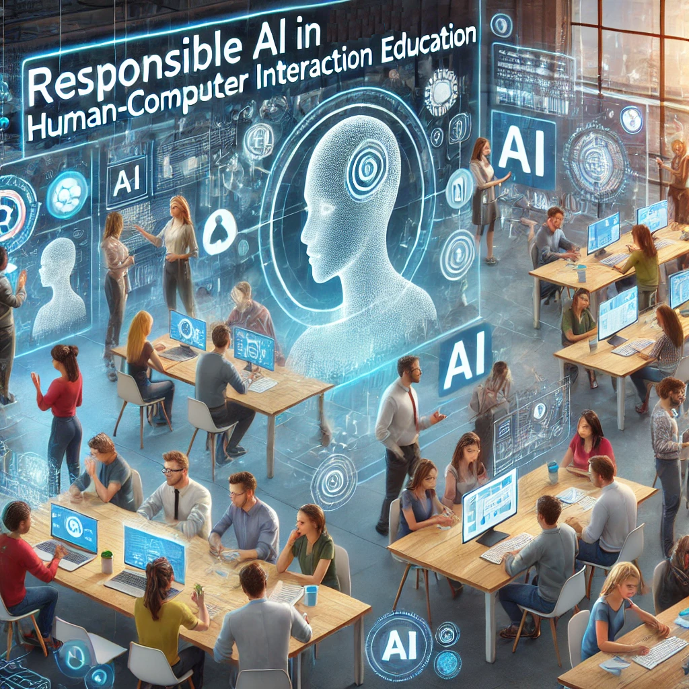

# Taller: IA responsable en la enseñanza de IHC

## Descripción  
Únete a nosotros para el 1er Taller sobre IA Responsable en la Enseñanza de IHC, este año en el contexto de la **<a href="https://www.mexihc.org/2024/en">10a Conferencia Internacional Mexicana sobre Interacción Humano-Computadora (MexIHC 2024)</a>**. Sólo envía un artículo corto para compartir tus avances o posición respecto a los temas de interés. Los datos clave son los siguientes: 

<ul>- <b>Evento:</b> presencial (Saltillo, Coahuila, México)</ul>
<ul>- <b>Fecha del taller:</b> *Por determinar*</i> (un día durante MexIHC)</ul>
<ul>- <b>Duración del taller:</b> 4 horas</ul>
<ul>- <b>Fecha límite para envíos:</b> 9 de agosto de 2024, 23:59h, AoE</ul>
<ul>- <b>Notificación de aceptación:</b> 23 de agosto de 2024</ul>
<ul>- <b>Envío final de versión lista para la publicación:</b> 13 de septiembre de 2024</ul>
<ul>- <b>Fechas de la conferencia:</b> 6 a 8 de noviembre de 2024</ul>
<ul>- <b>Envíe su artículo al correo:</b> <a href="responsibleai.hciedu@gmail.com">responsibleai.hciedu@gmail.com</a></ul>
<ul>- <b>Plantilla para redacción del artículo:</b> <a href="https://mexihc.org/aihc_template.zip">AmexIHC Template</a> (4-6 páginas incluyendo referencias)</ul>

Proponemos este taller en MexIHC 2024 para convocar a profesionales académicos y de la industria interesados ​​en intercambiar puntos de vista y enfoques sobre cómo la Inteligencia Artificial (IA), o más específicamente, la IA Generativa se puede tener en cuenta de manera responsable pero productiva al diseñar cursos y lecciones en el campo multidisciplinario de la Interacción Humano-Computadora. En el taller, discutiremos las experiencias y perspectivas de los participantes, y también realizaremos una actividad práctica para codiseñar lecciones de IHC teniendo en cuenta la IA responsable. En última instancia, nuestro objetivo es facilitar el desarrollo de una nueva comunidad en torno al tema de la IA responsable en la enseñanza de HCI.

## Objetivo del taller 

Este taller pretende reunir a partes interesadas con tres objetivos principales:
